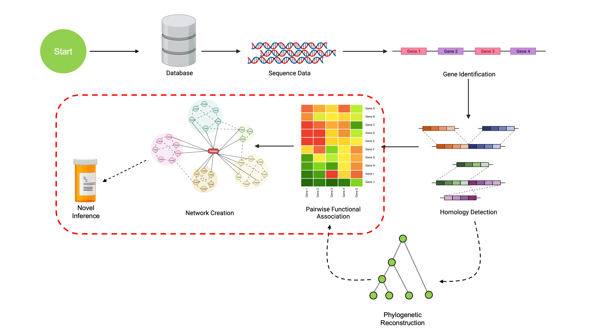

```{r setup, include=FALSE}
options(rmarkdown.html_vignette.check_title = FALSE)
knitr::opts_chunk$set(echo = TRUE)
library(DECIPHER)
library(SynExtend)
library(igraph)
```


```{r echo=FALSE, out.width='100%'}

```

## Coevolutionary Analysis

At this point, we've walked through the steps to take a set of sequences and obtain
a set of COGs with phylogenetic reconstructions for each COG. We're now ready to look for signals of coevolution, which imply functional associations between COGs.
These methods are implemented via the `ProtWeaver` class in `SynExtend`, which 
includes many commonly used methods for detecting coevolutionary patterns.

While the previous steps have only utilized a small subsample of the data, we're
now finally going to work with the complete dataset. This dataset is comprised
of the 91 *Micrococcus* genomes available with assemblies at the Scaffold, 
Chromosome, or Complete level ([link to query](https://www.ncbi.nlm.nih.gov/data-hub/genome/?taxon=1269&annotated_only=true&refseq_annotation=true&assembly_level=1%3A3)). Note that more genomes may become
available after this conference; these are all that were available at the time.

We ran the complete pipeline of identifying and annotating genes with `DECIPHER`, finding COGs with `SynExtend`, and then creating gene trees for each COG using `DECIPHER`. The complete data consist of 3,407 distinct COGs. All of this analysis
is performed entirely within `SynExtend` and `DECIPHER`; no external packages
or data are required aside from the input genomes.

We now use the new `ProtWeaver` class to try to find COGs that show evidence of
correlated evolutionary selective pressures, also referred to as 'coevolutionary
signal'.

```{css echo=FALSE}
.hvr-grow-shadow {
  display: inline-block;
  vertical-align: middle;
  -webkit-transform: perspective(1px) translateZ(0);
  transform: perspective(1px) translateZ(0);
  box-shadow: 0 0 1px rgba(0, 0, 0, 0);
  -webkit-transition-duration: 0.3s;
  transition-duration: 0.3s;
  -webkit-transition-property: box-shadow, transform;
  transition-property: box-shadow, transform;
}
.hvr-grow-shadow:hover, .hvr-grow-shadow:focus, .hvr-grow-shadow:active {
  box-shadow: 0 10px 10px -10px rgba(0, 0, 0, 0.5);
  -webkit-transform: scale(1.1);
  transform: scale(1.1);
}
```
```{r echo=FALSE}
dir <- system.file('extdata', 'CoevNetworks',
                             package='CompGenomicsBioc2022')
downloadthis::download_dir(
  path = dir,
  output_name = "CoevNetworkFiles",
  button_label = "Download Complete Micrococcus Dataset",
  button_type = "success",
  has_icon = TRUE,
  icon = "fa fa-download",
  self_contained = FALSE,
  class = "hvr-grow-shadow"
)
```

&nbsp;

```{r eval=FALSE}
library(DECIPHER)
library(SynExtend)

COGsFile <- '/path/to/MicrococcusCOGs.RData'
AnnotationsFile <- '/path/to/MicrococcusAnnotations.RData'
TreesFile <- '/path/to/MicrococcusGeneTrees.RData'

# All of these files are formatted the same way, as lists with each entry
# corresponding to a COG. COGs entries are identifiers for each gene, CogsAnnot 
# entries are annotations, and CogTrees entries are gene trees
load(COGsFile)          # Loads 'COGs'
load(AnnotationsFile)   # Loads 'CogsAnnot'
load(TreesFile)         # Loads 'CogTrees'
```
```{r echo=FALSE}
COGsFile <- system.file('extdata', 'CoevNetworks', 
                        'MicrococcusCOGs.RData',
                        package='CompGenomicsBioc2022')
AnnotationsFile <- system.file('extdata', 'CoevNetworks', 
                               'MicrococcusAnnotations.RData',
                        package='CompGenomicsBioc2022')
TreesFile <- system.file('extdata', 'CoevNetworks', 
                         'MicrococcusGeneTrees.RData',
                        package='CompGenomicsBioc2022')

load(COGsFile)      
load(AnnotationsFile) 
load(TreesFile) 
```

```{r}
# Let's look at one of the COGs
COGs[[7]]
CogsAnnot[[7]]
CogsAnnot[[7]][[1]]
CogTrees[[7]]

# Removing leaf labels because they make it hard to read
plot(CogTrees[[7]], leaflab='none', main='COG 7')
```

There is a ton of data here, and we unfortunately don't have time to look at 
all of it. To demonstrate some of the things we can do with `ProtWeaver`, we're
going to look at subset of the data that is easier to investigate. 

We'll subset the COGs to ones that meet the following characteristics:

- COGs with no paralogs
- COGs not part of the core genome
- COGs present in at least 5 genomes (not singletons or super rare ones)
- COGs with at least one high confidence annotation
- COGs that imply a coding region

These are relatively arbitrary requirements, but they subset the data to 
an example that runs quickly and is easily understandable. This essentially takes
a group of COGs that are not essential to the organisms but tend to appear a lot,
that have been characterized individually before.

```{r results='hide', fig.keep='all', warning=FALSE}
## Subsetting COGs

# Cutoff values (91 genomes total!)
CoreCutoff <- 88
UnderCutoff <- 5

# Get assembly identifiers for each COG
truncCOGs <- lapply(COGs, \(x) sort(as.integer(gsub('^([0-9]+)_.*', '\\1', x))))

# Find COGs without paralogs
noParas <- sapply(truncCOGs, \(x) length(x) == length(unique(x)))

# Get non-core genome
notCoreCOGs <- sapply(truncCOGs, \(x) length(unique(x)) < CoreCutoff)

# Get genes in more than 5 organisms
notSingles <- sapply(truncCOGs, \(x) length(unique(x)) > UnderCutoff)

# Make sure COGs are coding elements
codingCOGs <- sapply(CogsAnnot, \(x) is(x, 'Taxa'))

# At least one high confidence annotation
highConf <- sapply(CogsAnnot, \(x) 
                   if(is(x, 'Taxa')) 
                     max(sapply(x, \(y) 
                                y$confidence[length(y$confidence)])) > 50
                   else FALSE
                   )

# Subset for the workshop
WorkshopSubset <- noParas & notCoreCOGs & notSingles & codingCOGs & highConf

# Subset our data
WCogs <- COGs[WorkshopSubset]
WAnnots <- CogsAnnot[WorkshopSubset]
WTrees <- CogTrees[WorkshopSubset]
```

Let's also put together a list of consensus annotations for each COG.
```{r}
# Initialize a character vector to populate
consAnnots <- vector('character', length=length(CogsAnnot))

# Loop along the annotations for each COG
for ( i in seq_along(CogsAnnot) ){
  taxaentry <- CogsAnnot[[i]]
  
  # If no annotation, it's a noncoding gene
  if (!is(taxaentry, 'Taxa'))
    consAnnots[[i]] <- 'NONCODING'
  # Otherwise it's a coding gene
  else {
    # Grab all the annotations aside from "Unclassified"
    annots <- sapply(taxaentry, \(y) y$taxon[length(y$taxon)])
    annots <- annots[annots!='unclassified_Root']
    
    # If we only have "Unclassified", just mark it as uncharacterized
    if (length(annots) == 0)
      consAnnots[[i]] <- 'Uncharacterized'
    
    # Otherwise take the most common annotation
    else
      consAnnots[[i]] <- names(sort(table(annots), decreasing=T))[1]
  }
}
```

Now we can make our `ProtWeaver` object. `ProtWeaver` has multiple input options,
either a list formatted like `COGs` (list with gene identifiers) or a list like 
`CogTrees` (list with gene trees).

```{r eval=FALSE}
# ProtWeaver constructor
pw <- ProtWeaver(WTrees)
```

The `ProtWeaver` constuctor automatically detects the type of data you have and 
adjusts available predictors accordingly. While it functions best with a list
of dendrograms for each COG, it can also run with simple presence/absence patterns.
See the documentation file for `ProtWeaver` for more information on this functionality.

We're now ready to make predictions. Predicting functional associations is done
with the `predict.ProtWeaver` S3 method. Let's examine possible functional associations between the COGs we have.

```{r echo=FALSE}
OutFile <- system.file('extdata', 'CoevNetworks', 
                        'PrecomputedOutput.RData',
                        package='CompGenomicsBioc2022')
load(OutFile)
```

```{r eval=FALSE}
preds <- predict(pw)
```

```{r}
print(preds)
```
## Viewing our results

Notice that `preds` is a `ProtWeb` object. This is just a simple S3 class with a 
pretty print method wrapping a matrix of pairwise association scores. We can get
the raw data with `GetProtWebData()`:

```{r}
# Subset so the output is actually readable
GetProtWebData(preds)[1:7, 1:7]
```

We can also examine a histogram of association scores for all our predictions:

```{r}
pwData <- GetProtWebData(preds)
hist(pwData[upper.tri(pwData)], main='Histogram of Association Scores',
     xlab='Strength of Association')
```

The `ProtWeb` class will be updated next release cycle to include more methods, 
including a custom plotting function. The current `plot.ProtWeb` S3 method 
implements a force-directed embedding of the pairwise scores, but it's a
big work-in-progress. Stay tuned for the next release cycle for more functionality
regarding `ProtWeb`.

In the meantime, we can use the `igraph` package to find clusters of coevolving
COGs.

```{r eval=FALSE}
library(igraph)
```
```{r}
set.seed(1234) # Reproducibility

adjMatrix <- GetProtWebData(preds)
g <- graph_from_adjacency_matrix(adjMatrix, weighted=TRUE,
                                 mode='undirected', diag=FALSE)

clusters <- cluster_fast_greedy(g)

# Getting the clusters & identifying COGs by consensus annotation
clusterLabels <- vector('list', length(clusters))
for ( i in seq_along(clusterLabels) ){
  cluster <- communities(clusters)[[i]]
  labs <- consAnnots[as.integer(cluster)]
  clusterLabels[[i]] <- labs[order(sapply(labs, \(x) strsplit(x, ' ')[[1]][3]))]
}

# Let's examine a cluster
clusterLabels[[1]]
```

Note here that we've identified all the COGs in this group to be associated based
on coevolutionary pressures, and this conclusion is supported by annotation 
consistency across the members of this group. Of note here is that this clustering
was done with no prior knowledge on what these COGs do; we reached this conclusion
using purely sequencing data as input. This cluster is also very similar to 
results in [the STRING database](https://version-11-5.string-db.org/cgi/network?networkId=bHOgs2hNXWxE).
While STRING doesn't have the `nixA`, it does have `Achl_0397`, a similar
nickle/cobalt transporter. We also have a viral integrase, which potentially 
facilitates HGT of some of these genes. 
If we had conducted this analysis with hypothetical proteins, we could have 
inferred novel functions!

## Methods Implemented in ProtWeaver

By default, `predict.ProtWeaver` makes an ensemble prediction using as many individual
models as it can run with the data provided. However, users are free to use any of 
the individual models without the ensemble predictor. The methods implemented are 
the following:

```{r eval=FALSE}
# PHYLOGENETIC PROFILING METHODS:
  ## P/A = Presence/Absence Profiles
  ## Jaccard distance of P/A
Jaccard <- predict(pw, Method='Jaccard') 

  ## Hamming distance of P/A
Hamming <- predict(pw, Method='Hamming') 

  ## MutualInformation of P/A
MutualInf <- predict(pw, Method='MutualInformation')

  ## Direct Coupling Analysis of P/A
ProfDCA <- predict(pw, Method='ProfileDCA') 

  ## Correlation of gain/loss events on phylogeny, requires Species Tree
      ## Commented out because we don't have a species tree
#Behdenna <- predict(pw, Method='Behdenna', mySpeciesTree=exSpeciesTree)

# CO-LOCALIZATION METHODS:
Colocalization <- predict(pw, Method='Coloc') # Co-localization analysis

# DISTANCE MATRIX METHDOS:
MirrorTree <- predict(pw, Method='MirrorTree')
ContextTree <- predict(pw, Method='ContextTree')

# Residue Methods: (ONLY AVAILABLE IN DEV VERSION)
#   ## MutualInf of residues
ResidueMI <- predict(pw, Method='ResidueMI') 
```

## Runtime Considerations

Runtime of `ProtWeaver` depends on the number of COGs and the method used. Most of 
the methods are extremely quick, on the order of 0-1 seconds per comparison. 
The default `Method="Ensemble"` implements the fastest methods, giving a good
compromise between speed and accuracy. For a set of 100 COGs, `Ensemble` prediction
for all pairs took 30 seconds on a 2021 M1 MacBook Pro.

Note that number of pairs computed scales quadratically with the number of COGs.
100 COGs results in ~5k comparisons, but 200 COGs results in ~20k comparisons.

`ResidueMI` is currently the slowest method implemented, and is not used in 
`Ensemble` prediction. Prediction on 10 COGs took 30 seconds. Future releases
will optimize residue level methods for use in `Ensemble` prediction, but use of
these methods is inherently difficult due to runtime scaling on both the number of
COGs, the size of each tree, and the length of each gene sequence.

These predictions can be parallelized across multiple compute nodes. This implementation
is recommended for using `ResidueMI` on large datasets. A single `ResidueMI` comparison
completes in roughly 1 second, and `Ensemble` prediction in around 0.5 seconds.

```{css, echo=FALSE}
.pagination {
    display: flex;
    display: -webkit-flex;
    padding-left: 0;
    list-style: none;
    justify-content: center
}
```

<div class="center">
  <ul class="pagination pagination-lg">
    <li class="page-item">
      <a class="page-link" href="https://www.ahl27.com/CompGenomicsBioc2022/articles/ConstructingPhylogenies.html">&laquo;</a>
    </li>
    <li class="page-item">
      <a class="page-link" href="https://www.ahl27.com/CompGenomicsBioc2022/articles/Setup.html">1</a>
    </li>
    <li class="page-item">
      <a class="page-link" href="https://www.ahl27.com/CompGenomicsBioc2022/articles/LoadingGenomeData.html">2</a>
    </li>
    <li class="page-item">
      <a class="page-link" href="https://www.ahl27.com/CompGenomicsBioc2022/articles/GeneCallingAnnotation.html">3</a>
    </li>
    <li class="page-item">
      <a class="page-link" href="https://www.ahl27.com/CompGenomicsBioc2022/articles/FindingCOGs.html">4</a>
    </li>
    <li class="page-item">
      <a class="page-link" href="https://www.ahl27.com/CompGenomicsBioc2022/articles/ConstructingPhylogenies.html">5</a>
    </li>
    <li class="page-item active">
      <a class="page-link" href="https://www.ahl27.com/CompGenomicsBioc2022/articles/CoevolutionNetworks.html">6</a>
    </li>
    <li class="page-item">
      <a class="page-link" href="https://www.ahl27.com/CompGenomicsBioc2022/articles/Conclusion.html">7</a>
    </li>
    <li class="page-item">
      <a class="page-link" href="https://www.ahl27.com/CompGenomicsBioc2022/articles/Conclusion.html">&raquo;</a>
    </li>
  </ul>
</div>