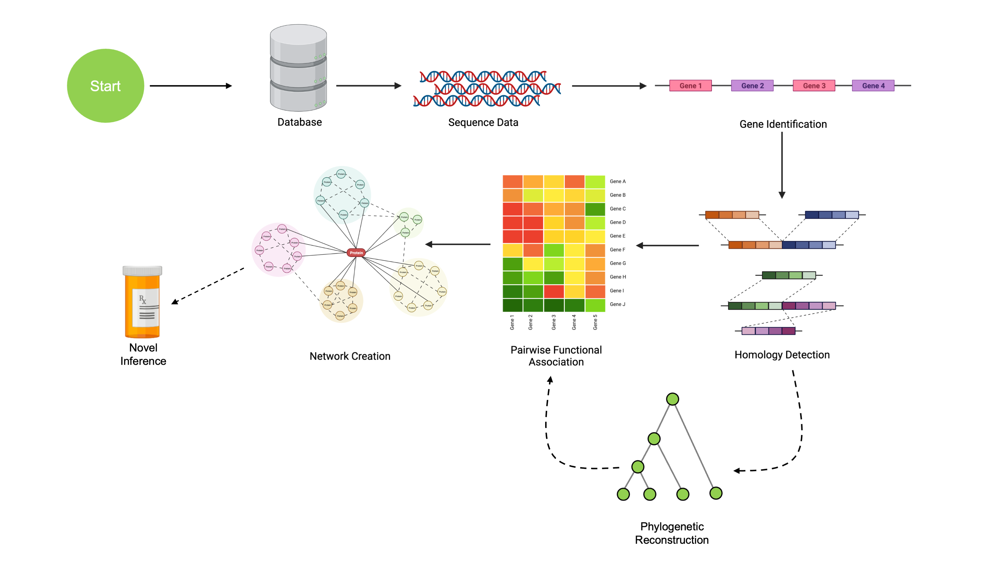

```{r setup, include=FALSE}
options(rmarkdown.html_vignette.check_title = FALSE)
```

```{r, include = FALSE}
knitr::opts_chunk$set(
  collapse = TRUE,
  comment = "#>"
)
```
Authors: Aidan Lakshman, Nicholas Cooley, Erik S. Wright[^1].

[^1]: All authors affiliated with University of Pittsburgh

### Description

This workshop consists of an interactive, instructor-led demonstration of common
analyses in comparative genomics. 

The immediate goal of this session is to use sequence data to uncover networks of 
functionally associated genes. These networks consist of genetic regions under 
shared evolutionary pressure, which have previously been shown to imply some 
degree of conserved function. The complete pipeline consists of the following:

```{r echo=FALSE, out.width='100%'}

```

We'll walk through obtaining sequence data, working with it, identifying genes,
finding orthologous regions, creating phylogenetic reconstructions, and then
identifying functional association networks. These networks can be used to make
novel hypotheses about protein functional pathways.

The overall purpose of this workshop is slightly more broad: to teach 
users how to utilize a wide variety of tools for computational genomics. Walking
through our pipline serves as a convenient mechanism to guide instruction in a set
of broadly applicable tools that can easily be repurposed to many other problems.

This workshop will showcase the following functionalities through hands-on tutorials
with real data:

- Reading sequence data into R
- Aligning sequences
- Phylogenetic reconstruction
- Identifying coding and non-coding regions
- Annotating gene function
- Finding clusters of orthologous genes (COGs)
- Predicting functional association between COGs

All of these analyses will be conducted entirely within R, and are achievable using
only raw sequencing data along with the `DECIPHER` and `SynExtend` packages.

EDIT: Due to time constraints, we're going to focus on predicting functional 
associations between COGs, and if time permits we can work our way backward 
to the rest of the content. Users are encouraged to read the other pages
later on.

### Prerequisites

Both `DECIPHER` and `SynExtend` are developed to be as simple as possible for the 
end user. As such, the only pre-requisites for this workshop are the following:

-   Basic knowledge of R syntax
-   Basic knowledge of genomics data (DNA, RNA, amino acids)

Participants can expect to fully understand the entire workshop with only the above
qualifications. However, users that want to dig deeper into the content covered
may consider checking [the DECIPHER website](http://www2.decipher.codes/) for
additional tutorials.

### Participation

Attendees will be expected to participate by following along with the examples 
provided in the workshop. Rather than just listening to instruction, attendees
are expected to run the examples for themselves and ask questions related to either
steps in the workshop or related scenarios these methods could be applicable to
for their own work.

### *Bioconductor* packages used

-   [`DECIPHER`](http://bioconductor.org/packages/release/bioc/html/DECIPHER.html)
-   [`SynExtend`](http://bioconductor.org/packages/release/bioc/html/SynExtend.html)

### Time outline

Timing is estimated and may vary depending on questions from audience.

| Activity                                 |  Package  |        Time        |
|:-----------------------------------------|:---------:|-------------------:|
| Introduction and Setup                   |           |            20 min  |
| Working with Genomic Data                | `DECIPHER`|            0 min   |
| Gene Calling and Annotation              | `DECIPHER`|            0 min   |
| Finding COGs                             |`SynExtend`|            0 min   |
| Phylogenetic Reconstruction              | `DECIPHER`|            0 min   |
| Identifying Co-evolving Gene Collectives |`SynExtend`|          30 min   |
| Concluding Remarks                       |           |          10 min   |
| Q & A                                    |           |   Remaining Time   |

### Workshop goals and objectives

The "big picture" goal of this workshop is to enable researchers to conduct
computational analyses involving genomics data independently on a wide variety
of problems. Not every attendee will need to identify co-evolving gene clusters,
but having the ability to conduct analyses like aligning genomes, creating 
phylogenetic trees, or finding shared selective pressure across genomes is 
valuable for any researcher in molecular biology to be able to quickly analyze
preliminary data and guide experimental hypotheses.

At the conclusion of this workshop, attendees will possess a toolkit of analyses
they can apply to their own data. Computational analyses are increasingly valuable
in the modern era of microbiology, and attendees of this workshop will gain 
sufficient expertise to be able to conduct basic *in silico* analyses, 
even if they don't have a deep bioinformatics background.

### Learning goals

-   Describe how to work with and visualize sequencing data in R 
-   Identify methods to analyze evolutionary forces on genetic regions
-   Identify orthologous genomic regions
-   Identify and annotate gene function

### Learning objectives

-   Analyze sequencing data to produce experimental hypotheses
-   Generate phylogenetic reconstructions to investigate the evolutionary history
    of a set of genomes
-   Mine big genomic data to find regions with conserved function across organisms

&nbsp;

&nbsp;

&nbsp;

```{css, echo=FALSE}
.btn-lg, .btn-group-lg>.btn{
    padding: 0.5rem 1rem;
    font-size: 1.25rem;
    border-radius: 0.3rem;
    width: 100%;
}
```
<div class="d-grid gap-2">
  <a href='https://www.ahl27.com/CompGenomicsBioc2022/articles/Setup.html' class="btn btn-lg btn-primary" type="button">Get Started!</a>
</div>
