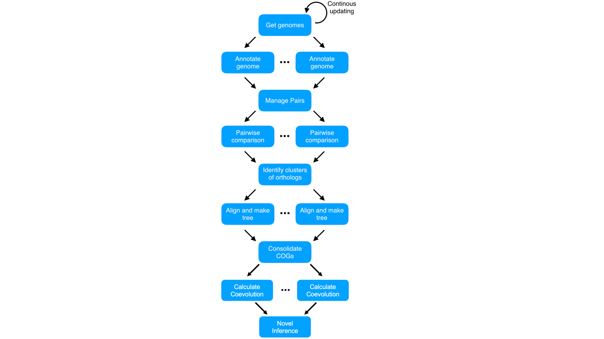

```{r setup, include=FALSE}
options(rmarkdown.html_vignette.check_title = FALSE)
knitr::opts_chunk$set(echo = TRUE)
```

```{r echo=FALSE, out.width='100%'}
knitr::include_graphics('images/PipelineOverview.png')
```

This tutorial has walked through a complete pipeline of comparative genomic
analysis. By using this tool, we've been able to generate hypotheses of 
functional associations between genetic regions using only raw sequence data
as input. Along the way, we've covered the following:

- Working with sequencing data, including alignment and visualization
- Finding and annotating genes from sequencing data
- Finding Clusters of Orthologous Genes (COGs)
- Reconstructing the evolutionary history of COGs
- Analyzing coevolutionary signal between COGs

This coevolutionary signal allows us to generate hypotheses about possible unknown
functional associations between proteins. In the previous example, we were able
to correctly identify a cluster of ureases using only sequencing data.

This pipeline works on both genes that have been previously characterized and those that have not, meaning we can guide future wet lab investigation with these predictions. Future work will investigate ways to improve our predictions, so stay tuned to the `SynExtend` package as it develops!

## Implementation at Scale

While our analyses are designed to be scalable, they are not yet fast enough
to be able to examine thousands of genomes within a single workshop. Since we
eventually need to make comparisons between every pair of COGs, the task grows
quadratically as more genomes (and thus more COGs) are analyzed. Because of this,
we chose a smaller test set to showcase performance in this workshop.

However, our methods can scale to many more genomes. All of our methods are designed
to be run in parallel across a supercomputer system. The majority of the methods
have low CPU and memory requirements, and thus can be run on small (2-4GB memory)
nodes. We have recently completed analysis of all available *Streptomyces* genomes,
which can complete in as little as an hour given sufficient compute nodes.

Our pipeline of analysis looks like this:

```{r echo=FALSE, out.width='100%', fig.align='center'}

```


### Runtime Estimations
The following is a rough estimate of runtime considerations at each stage of the 
pipeline. These examples use *Streptomyces* genomes, which are roughly 7-9 megabases.
Stages marked `single` are only run once, whereas `parallel` are run multiple times.
"Runtime" denotes total runtime if `single` and runtime per iteration if `parallel`.
More details on each runtime component are available on the corresponding pages.

For scaling, $G$ is the number of Genomes, $g$ is the number of genes, $C$ is the number
of COGs, $g_C$ is the number of genes in a particular COG.

`NJ`, `MP`, and `ML` denote Neighbor Joining, Maximum Parsimony, and Maximum Likelihood (respectively).
`ML` is more accurate than `MP` at the cost of increased runtime, and the same is true of `MP` and `NJ`. See the section on
[Phylogenetics](https://www.ahl27.com/CompGenomicsBioc2022/articles/ConstructingPhylogenies.html) for more info.


| Pipeline Stage        |  Scaling  | Single or Parallel | *Streptomyces* Example | Example Runtime |
|:-------------------:|:---------:|:---------:|:---------:|:-------:|
| Get Genomes     |  $O(G)$ |  Single  | 300 Genomes  |  ~60 sec |
| Find Genes     | $O(G)$ | Parallel | Single Genome | ~15 min |
| Annotate Genes | $O(G)$ |  Parallel | Single Genome | ~20 min |
| Pairwise Orthology | $O(G^2)$ | Parallel |  Pair of Genomes |  ~10 min |
| Ortholog Pairs to COGs   | $O(g^2)$ | Single |  All pairs from 300 Genomes | ~5 min |
| Align and Make Tree | $O(C)$ | Parallel  |  Single COG | <1 sec (NJ) <br/> ~0.5 hr (MP) <br/> ~13 hr (ML) |
| Calculate Coevolution | $O(C^2)$ | Parallel |  Pair of COGs | ~5 sec |
| (Optimal) Total Runtime | --- | --- | 300 Genomes | ~1 hr (NJ) <br/> ~1.5 hr (MP) <br/> ~14 hr (ML) |

For this example, 300 *Streptomyces* genomes resulted in ~2.2 million genes,
resulting in ~65k COGs. Overall runtime depends on the phylogenetic reconstruction
algorithm used. Tree construction is performed using amino acid alignments.

Users interested in deploying these analyses at scale are encouraged to contact
our lab for more information! 

## Thank you!

If you've made it through this entire tutorial, thank you for following along!
I hope this series was informative and useful to your analyses. All code showcased
here is actively being worked on by members of our lab, especially the `EvoWeaver`
and `EvoWeb` functionalities. If you have any comments, suggestions, or feature requests
for `EvoWeaver`, `EvoWeb`, or this tutorial, please feel free to either email me at 
ahl27@pitt.edu or open an issue on GitHub.

## Other Resources

If you're interested in learning more about me, our lab, or phylogenetics, check
out these resources:

- [My website](https://ahl27.com)
- [The Wright Lab](https://wrightlabscience.com)
- [Intro to Phylogenetics](https://www.ahl27.com/IntroPhylogenetics/)
- [More DECIPHER Tutorials](http://www2.decipher.codes/)


```{css, echo=FALSE}
.pagination {
    display: flex;
    display: -webkit-flex;
    padding-left: 0;
    list-style: none;
    justify-content: center
}
```

<div class="center">
  <ul class="pagination pagination-lg">
    <li class="page-item">
      <a class="page-link" href="https://www.ahl27.com/CompGenomicsBioc2022/articles/CoevolutionNetworks.html">&laquo;</a>
    </li>
    <li class="page-item">
      <a class="page-link" href="https://www.ahl27.com/CompGenomicsBioc2022/articles/Setup.html">1</a>
    </li>
    <li class="page-item">
      <a class="page-link" href="https://www.ahl27.com/CompGenomicsBioc2022/articles/LoadingGenomeData.html">2</a>
    </li>
    <li class="page-item">
      <a class="page-link" href="https://www.ahl27.com/CompGenomicsBioc2022/articles/GeneCallingAnnotation.html">3</a>
    </li>
    <li class="page-item">
      <a class="page-link" href="https://www.ahl27.com/CompGenomicsBioc2022/articles/FindingCOGs.html">4</a>
    </li>
    <li class="page-item">
      <a class="page-link" href="https://www.ahl27.com/CompGenomicsBioc2022/articles/ConstructingPhylogenies.html">5</a>
    </li>
    <li class="page-item">
      <a class="page-link" href="https://www.ahl27.com/CompGenomicsBioc2022/articles/CoevolutionNetworks.html">6</a>
    </li>
    <li class="page-item">
      <a class="page-link" href="https://www.ahl27.com/CompGenomicsBioc2022/articles/Conclusion.html">7</a>
    </li>
    <li class="page-item disabled">
      <a class="page-link" href="#">&raquo;</a>
    </li>
  </ul>
</div>