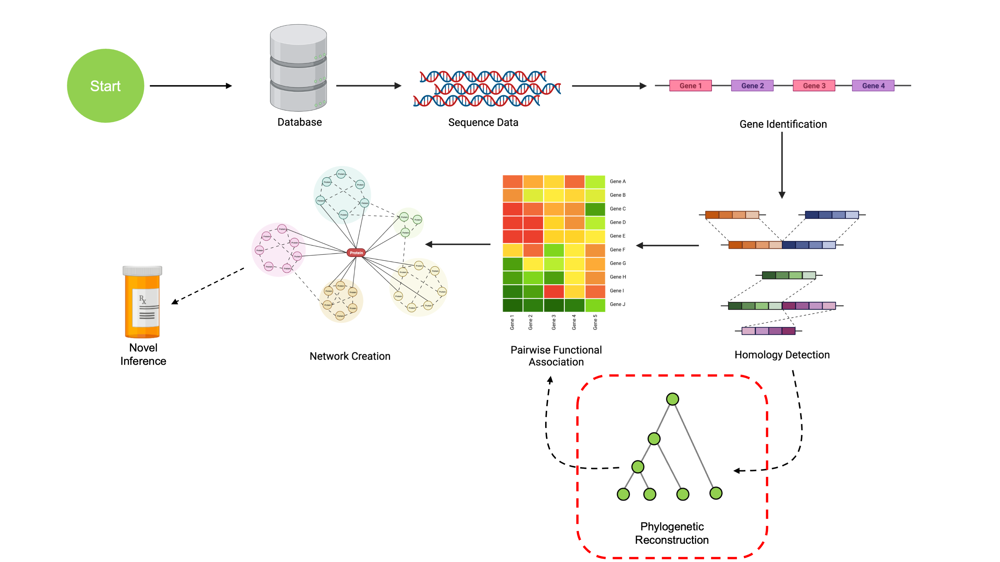

```{r setup, include=FALSE}
options(rmarkdown.html_vignette.check_title = FALSE)
knitr::opts_chunk$set(echo = TRUE, out.width='1000px', dpi=200)
library(DECIPHER)
library(SynExtend)

newTreeLine <- system.file('extdata', 'TreeLine.R', 
                            package='CompGenomicsBioc2022')
source(newTreeLine, local=knitr::knit_global())
```

```{r echo=FALSE, out.width='100%'}

```

## Phylogenetic Reconstruction

We've now learned how to find Clusters of Orthologous Genes (COGs) from a set of 
sequences. The last thing we need for our final analysis are phylogenetic 
reconstructions of each gene cluster. In this step, we'll build phylogenies for
our COGs using the new `TreeLine()` function introduced in the latest update 
of `DECIPHER`. This analysis uses the third COG from the previous section
(if you don't have it, you can download it below!).


```{css echo=FALSE}
.hvr-grow-shadow {
  display: inline-block;
  vertical-align: middle;
  -webkit-transform: perspective(1px) translateZ(0);
  transform: perspective(1px) translateZ(0);
  box-shadow: 0 0 1px rgba(0, 0, 0, 0);
  -webkit-transition-duration: 0.3s;
  transition-duration: 0.3s;
  -webkit-transition-property: box-shadow, transform;
  transition-property: box-shadow, transform;
}
.hvr-grow-shadow:hover, .hvr-grow-shadow:focus, .hvr-grow-shadow:active {
  box-shadow: 0 10px 10px -10px rgba(0, 0, 0, 0.5);
  -webkit-transform: scale(1.1);
  transform: scale(1.1);
}
```
```{r echo=FALSE}
f <- system.file('extdata', 'Phylogenies',
                        'testCOG.RData',
                        package='CompGenomicsBioc2022')
downloadthis::download_file(
  path = f,
  button_label = "Download COG Data",
  button_type = "success",
  has_icon = TRUE,
  icon = "fa fa-download",
  self_contained = FALSE,
  class = "hvr-grow-shadow"
)
```

&nbsp;

```{r eval=FALSE}
library(DECIPHER)

# This is downloadable using the above button
# If you finished the previous page, this is MatchedSequences[[3]]
datafile <- '/path/to/testCOG.RData'
```

```{r echo=FALSE}
datafile <- system.file('extdata', 'Phylogenies',
                        'testCOG.RData',
                        package='CompGenomicsBioc2022')
```

```{r results='hide'}
# Load in example COG 
# Again, this is COG 3 from the previous section, which you can get with:
# testCOG <- MatchedSequences[[3]]

# If you don't have it, load it in this way
load(datafile, verbose=TRUE) # Should load 'testCOG'

# Let's make the names a little more concise
# These COGs exist in pairs with two lengths
# We'll code them as <Assembly><A/B>, where A is the longer sequence
# This renaming will make plotting look a little nicer
names(testCOG) <- c('1A', '1B', '2A', '2B',
                    '3B', '3A', '4B', '4A', 
                    '5A', '5B')
testCOG <- testCOG[order(names(testCOG))]
```
```{r}
# Let's look at the aligned COG sequences
testCOG
```
```{r results='hide', fig.keep='all'}
# Since these are coding regions, AlignTranslation is preferred
testSeqs <- AlignTranslation(testCOG)

# Construct a gene tree from aligned sequences
treeCOG1 <- TreeLine(testSeqs, method='MP')

# Visualize the result
plot(treeCOG1, main='MP')
```

That's all we need to construct a quick phylogenenetic tree in R! We could also set
the optional argument `reconstruct=TRUE` to have `TreeLine` automatically reconstruct ancestral states 
at each node.

However, `TreeLine` incorporates a wealth of functionality past what is detailed here. 
In fact, this tree isn't even the best tree we can make! Let's take a look at all 
the new features included in the `TreeLine()` function.

## Tree-Building Methods

Our first example used `method='MP'`, meaning it constructed a phyletic tree
using a Maximum Parsimony method. However, many more methods are available. 
`TreeLine()` implements Maximum Parsimony (`MP`), Neighbor-Joining (`NJ`), 
Ultrametric (`complete`, `single`, `UPGMA`, `WPGMA`), and Maximum Likelihood (`ML`)
methods. Each of these have different strengths, weaknesses, and assumptions. While
an in-depth look at the difference between these methods is outside the scope of
this tutorial, I recently published [another tutorial](https://www.ahl27.com/IntroPhylogenetics/)
that goes into the mathematics of how these methods work.

Example code for each of these:
```{r results='hide', fig.keep='all'}
# Maximum Parsimony
treeMP <- TreeLine(myXStringSet=testSeqs, method='MP', reconstruct=TRUE)
plot(treeMP, main='MP')
```
```{r results='hide', fig.keep='all'}
# Neighbor-Joining
distMatrix <- DistanceMatrix(testSeqs)
treeNJ <- TreeLine(myDistMatrix=distMatrix, method='NJ')
plot(treeNJ, main='NJ')
```
```{r results='hide', fig.keep='all'}
# UPGMA tree
distMatrix <- DistanceMatrix(testSeqs)
treeUltra <- TreeLine(myDistMatrix=distMatrix, method='UPGMA')
plot(treeUltra, main='UPGMA')
```

Maximum-Likelihood trees are the most accurate, but also the slowest to create. 
This method iteratively maximizes the likelihood of the tree under a given sequence
evolution model for a set of aligned sequences. In the interest of time, this 
demo will set the `maxTime` argument to prevent the algorithm from taking too long.

```{r results='hide', fig.keep='all'}
# Maximum Likehood
#   - Max runtime is set here to 30sec, default is as long as it takes
#   - maxTime expresses time in HOURS, not sec/min
#   - Note that method='ML' is the default setting
#   - Longer runtime will produce better results
treeML <- TreeLine(testSeqs, maxTime=(30/3600))
plot(treeML, main='Maximum-Likelihood')
```

## Sequence Evolution Models

One question you're probably asking is, "What is this 'given sequence evolution
model'?" That's an excellent question!

By default, `TreeLine()` will test a variety
of sequence evolution models and pick the one that works best for your data. 
This means that you shouldn't typically have to worry about which model to use.

However, what if we wanted to explicitly pick a certain model? What if we wanted
to exclude a handful of models? Or what if we're just curious what models are even
being tested?

Fret not, for there is a solution. Models are passed to `TreeLine()` as a list
with two named entries, `$Nucleotide` and `$Protein`. To look at the default 
models tested, simply print out the `MODELS` variable included from `DECIPHER`:

```{r}
DECIPHER::MODELS
```

Nucleotide models include classic names like Jukes-Cantor (`JC69`) and Felsenstein
1981 (`F81`), as well as many others. The amino acid substitution models contain
a mixture of general models (e.g. `BLOSUM62`, `Dayhoff`), as well as models tailored
towards specific organisms (e.g. `Q.insect`, `HIVb`).

To use a single model, simply create a list matching the structure of `MODELS`, 
just with the models you want to include. To exclude certain models, copy `MODELS` 
and remove the entries you don't want. 

```{r results='hide',fig.keep='all'}
# Using a specific set of models
mySpecificModel <- list(Nucleotide=c('JC69', 'HKY85'))
specTree <- TreeLine(testSeqs, model=mySpecificModel, maxTime=(30/3600))
plot(specTree, main='Specific Set ML')

# Excluding Specific Models
myExcludedModel <- DECIPHER::MODELS
myExcludedModel$Protein <- NULL # Remove all protein models
myExcludedModel$Nucleotide <- myExcludedModel$Nucleotide[-1] # Remove JC69
exclTree <- TreeLine(testSeqs, model=myExcludedModel, maxTime=(30/3600))
plot(exclTree, main='Excluded Set ML')
```

## Runtime Considerations

Runtime depends greatly on the tree construction method used. Phylogenetic 
reconstruction methods exhibit a tradeoff between accuracy and runtime; slower
algorithms yield better performance.

Runtime scales with the number of genes and the length of each gene. For all
below estimates, trials were done using a set of 100 genes with an aligned 
length of ~350 bases on a single core compute node with 1GB RAM. 
Reconstruction in amino acid space is slower on average than
reconstruction in nucleotide space.

Maximum likelihood methods are the most accurate but also the slowest. For our 
test set of 100 genes, total runtime for nucleotide alignments takes on the order of 1-3 hours, and for amino acid alignments on the order of 10-12 hours.

Maximum parsimony methods are typically a good compromise between speed and 
accuracy. On our test set, total runtime was around 5-10 minutes for nucleotide alignments,
and around 30 minutes for amino acid alignments.

All the other methods (Neighbor Joining, UPGMA, etc.) are extremely fast, but have
much lower accuracy than MP/ML. Constructing a tree with these method (including
building a distance matrix) takes less than 1 second.

## Conclusion

That's all we need to know how to do to generate phylogenies for our dataset. 
In order to conduct our final coevolutionary analysis, we're going to need 
to build a gene tree for all of our COGs. I've precomputed these trees for us,
so we can load those in in the next step without having to worry about long runtimes.

There are a few other parameters I didn't mention in this writeup. The most significant
one for our use is `reconstruct=TRUE`, as this reconstructs ancestral states (which
will be important for later analyses). There are also additional arguments for 
multiprocessing (`processors=1`), using Laguerre quadrature for likelihoods 
(`quadrature=T/F`), switching the type of information criterion for ML trees
(`informationCriterion=c('AICc', 'BIC')`), and many others. See the documentation
page for more information on these--for now, we'll continue on to our final goal.

```{css, echo=FALSE}
.pagination {
    display: flex;
    display: -webkit-flex;
    padding-left: 0;
    list-style: none;
    justify-content: center
}
```

<div class="center">
  <ul class="pagination pagination-lg">
    <li class="page-item">
      <a class="page-link" href="https://www.ahl27.com/CompGenomicsBioc2022/articles/FindingCOGs.html">&laquo;</a>
    </li>
    <li class="page-item">
      <a class="page-link" href="https://www.ahl27.com/CompGenomicsBioc2022/articles/Setup.html">1</a>
    </li>
    <li class="page-item">
      <a class="page-link" href="https://www.ahl27.com/CompGenomicsBioc2022/articles/LoadingGenomeData.html">2</a>
    </li>
    <li class="page-item">
      <a class="page-link" href="https://www.ahl27.com/CompGenomicsBioc2022/articles/GeneCallingAnnotation.html">3</a>
    </li>
    <li class="page-item">
      <a class="page-link" href="https://www.ahl27.com/CompGenomicsBioc2022/articles/FindingCOGs.html">4</a>
    </li>
    <li class="page-item active">
      <a class="page-link" href="https://www.ahl27.com/CompGenomicsBioc2022/articles/ConstructingPhylogenies.html">5</a>
    </li>
    <li class="page-item">
      <a class="page-link" href="https://www.ahl27.com/CompGenomicsBioc2022/articles/CoevolutionNetworks.html">6</a>
    </li>
    <li class="page-item">
      <a class="page-link" href="https://www.ahl27.com/CompGenomicsBioc2022/articles/Conclusion.html">7</a>
    </li>
    <li class="page-item">
      <a class="page-link" href="https://www.ahl27.com/CompGenomicsBioc2022/articles/CoevolutionNetworks.html">&raquo;</a>
    </li>
  </ul>
</div>