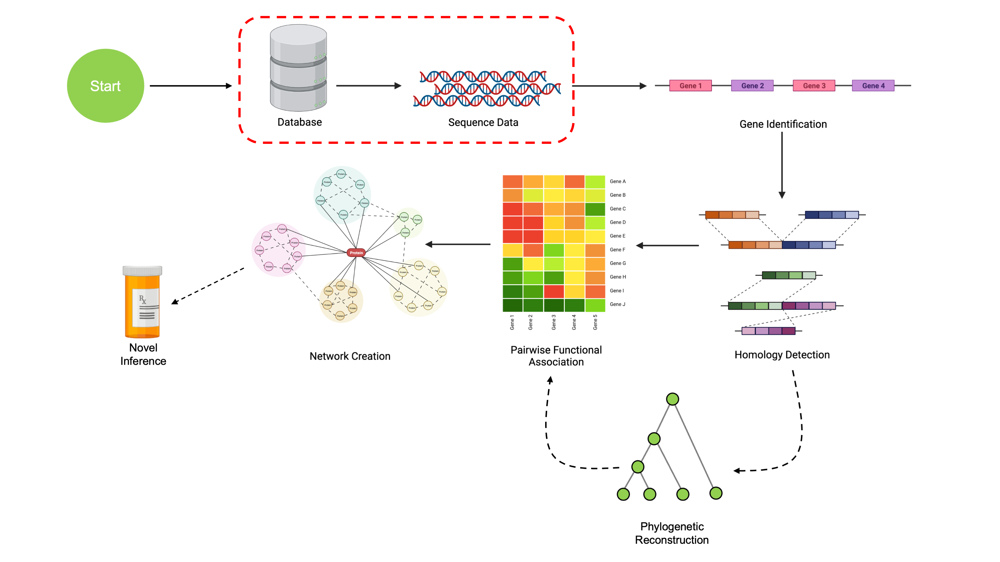
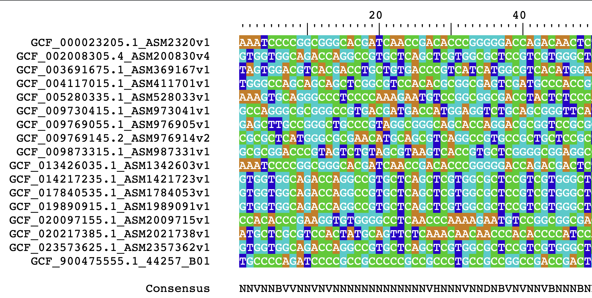
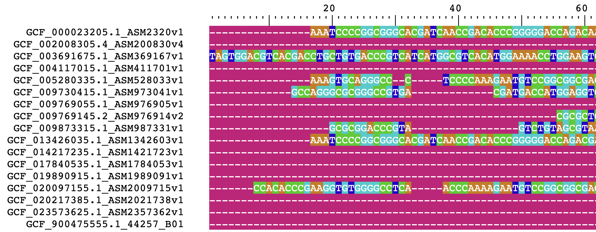
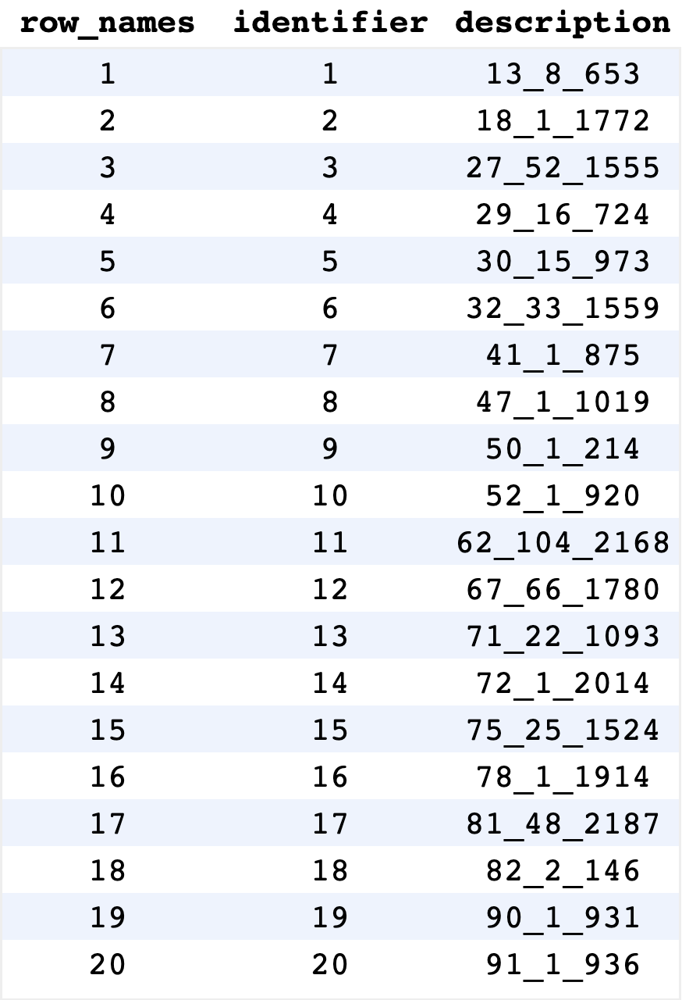

```{r setup, include=FALSE}
options(rmarkdown.html_vignette.check_title = FALSE)
knitr::opts_chunk$set(echo = TRUE)
library(DECIPHER)
```

```{r echo=FALSE, out.width='100%'}

```

## Reading in Sequencing Data

In order to work with sequencing data, we first have to get it into R in a format
that allows us to work with it. The most commonly used formats for genomic data are
the `XString` and `XStringSet` classes, which are available through the `Biostrings`
package.

`XStrings` come in four distinct flavors, depending on the characters allowed:

- `DNAString`, for DNA data (`ATGC`, plus gaps and ambiguity codes)
- `RNAString`, for RNA data (`AUGC`, plus gaps and ambiguity codes)
- `AAString`, for amino acid data (20 amino acids plus `U`, `O`, ambiguity codes, and unknown/gaps)
- `BString`, for any combination of any letters

When `XString` objects of the same type are combined, they become an `XStringSet`. 
This provides an easy way to store and work with genomics data. Below is an
example of manually creating an `XStringSet`:
```{r eval=FALSE}
library(DECIPHER) # Auto-imports Biostrings
```

```{r}

# Making some toy sequences
sequences <- c('AGACTCGCA',
               'AGACGGTCA',
               'TCATTAGTT',
               'TGCACAAAA',
               'AGCTGTTGC')

sequenceSet <- DNAStringSet(sequences)
sequenceSet
```

We can also translate DNA sequences to their amino acid counterparts with `translate()`.
```{r warning=FALSE}
translate(sequenceSet)
```

Manually typing in sequences obviously isn't a great system. Modern sequencing data are typically in `.fasta` or `.fastq` file format, so let's look at a more realistic
use-case that reads in a data from a `.fasta`. We're going to be using an example
from *Micrococcus* genomes obtained from [NCBI GenBank](https://www.ncbi.nlm.nih.gov/data-hub/genome/?taxon=1269&annotated_only=true&refseq_annotation=true&assembly_level=3%3A3). 

For purposes of the workshop, I've reduced the dataset to a single *Micrococcus*
gene. This expedites examples to allow for quick processing. These sequences
have been packaged into a single `.FASTA` file (compressed into a `.fa.gz` file),
which you can download with the below button. Each gene is uniquely identified
with a three number code detailed on the [Finding COGs page](https://www.ahl27.com/CompGenomicsBioc2022/articles/FindingCOGs.html).

```{css echo=FALSE}
.hvr-grow-shadow {
  display: inline-block;
  vertical-align: middle;
  -webkit-transform: perspective(1px) translateZ(0);
  transform: perspective(1px) translateZ(0);
  box-shadow: 0 0 1px rgba(0, 0, 0, 0);
  -webkit-transition-duration: 0.3s;
  transition-duration: 0.3s;
  -webkit-transition-property: box-shadow, transform;
  transition-property: box-shadow, transform;
}
.hvr-grow-shadow:hover, .hvr-grow-shadow:focus, .hvr-grow-shadow:active {
  box-shadow: 0 10px 10px -10px rgba(0, 0, 0, 0.5);
  -webkit-transform: scale(1.1);
  transform: scale(1.1);
}
```
```{r echo=FALSE}
f <- system.file('extdata', 'LoadingData', 'MicroFASTAtrimmed.fa.gz', 
                            package='CompGenomicsBioc2022')
downloadthis::download_file(
  path = f,
  button_label = "Download Example Sequences",
  button_type = "success",
  has_icon = TRUE,
  icon = "fa fa-download",
  self_contained = FALSE,
  class = "hvr-grow-shadow"
)
```


```{r, echo=FALSE}
exampleSeqs <- system.file('extdata', 'LoadingData', 'MicroFASTAtrimmed.fa.gz', 
                            package='CompGenomicsBioc2022')

exStringSet <- readDNAStringSet(exampleSeqs, format="fasta")
```

&nbsp;

```{r, eval=FALSE}
# MicroFASTAtrimmed.fa.gz is loaded from the above button
# also available at extdata/LoadingData/ within this package

exampleSeqs <- '/path/to/MicroFASTAtrimmed.fa.gz'

exStringSet <- readDNAStringSet(exampleSeqs, format="fasta")
# we could also use format='fastq' for FASTQ datasets
```

```{r}
exStringSet
```
Success! Now we have a large example dataset to work with.

If we wanted to visualize these sequences, we can open them in a web browser
using `BrowseSeqs()` from `DECIPHER`:

```{r, eval=FALSE}
BrowseSeqs(exStringSet)
```

```{r echo=FALSE, out.width='100%'}

```

## Aligning Sequences

Now that we have some sequences, let's explore some of the ways we can manipulate
them. A complete demo of `Biostrings` is outside the scope of this workshop, so
we'll just focus on functionality added via `DECIPHER`. 

A common analysis in 
bioinformatics is aligning sequences. This is easily achievable with either the 
`AlignSeqs()` function or the `AlignTranslation()` functions from `DECIPHER`. 
`AlignTranslation()` aligns sequences based on their translated amino acid 
sequences, and is significantly more accurate for coding sequences (like the
ones we're working with).

```{r}
# Align the sequences
aliNoTranslate <- AlignSeqs(exStringSet, verbose=FALSE)

# Aligning using translated amino acid sequences
# These sequences are coding sequences, so this function will be more accurate
aliTranslate <- AlignTranslation(exStringSet, verbose=FALSE)

# Visualize through R 
aliTranslate
```

Alignments tend to start with a lot of gaps, and as a result viewing them through
R isn't always super informative.
As before, we can visualize this alignment in a much better way using `BrowseSeqs()`:

```{r, eval=FALSE}
BrowseSeqs(aliTranslate)
```

The output should resemble the following:

```{r echo=FALSE, out.width='100%'}

```

&nbsp;

## Big Data with DECIPHER

One of `DECIPHER`'s unique features is the ability to work with massive amounts
of data. `DECIPHER` incorporates a rich API for working with sequencing data 
stored in SQLite files. These allow users to work with enormous amounts of data
(ex. hundreds of thousands of sequences) while providing the following benefits:

- Space optimization
- Fast random access
- Concurrent use from multiple queries/users
- Reliable and cross-platform storage

For more information on all the benefits of using databases
with `DECIPHER`, check out the [`DECIPHER` publication](https://journal.r-project.org/archive/2016/RJ-2016-025/index.html).

Setting up a `DECIPHER` database takes a few extra lines of code, but it's worth it!
Let's start by creating a connection to a SQLite database.

```{r}
# You can set this to any path, use a non-tempfile for long term storage
DBPATH <- tempfile()
dbConn <- dbConnect(SQLite(), DBPATH)
```

Now we have a connection to a database! I used `tempfile()` for a temporary file,
but you could have also added a filepath to a non-temporary file. Note that if
the file does not exist, it will be automatically created.

Now it's time to start populating our database with sequences!
This is done with `Seqs2DB()` with the following syntax:

```{r}
# All sequences must be identified with a unique quantifier
# This has to be a character vector; we can make it 1:length(exStringSet)
identifiers = as.character(seq_along(exStringSet))
Seqs2DB(seqs=exStringSet, type='XStringSet', 
        dbFile=dbConn, identifier=identifiers)
```

We can also write sequences directly from a `FASTA` file to our database.
In this code, we're using `replaceTbl=TRUE` so that we replace our table
with the sequences (rather than add the same set twice).
```{r}
# We can also directly import from a FASTA file 
# FASTA files 
Seqs2DB(seqs=exampleSeqs, type='FASTA', 
        dbFile=dbConn, identifier=identifiers,
        replaceTbl=TRUE)
```

Now that we have our database, what do we do with it? 

To start, we can run `BrowseDB()`, a function analogous to `BrowseSeqs()` but
for `DECIPHER` databases. Instead of showing sequences, this visualization shows
entries in the database that can be queried. 

```{r eval=FALSE}
BrowseDB(dbConn)
```

```{r echo=FALSE, out.width='100%'}

```

If we want to read the sequences back into R as an `XStringSet`, we use `SearchDB()`.

```{r}
dbStringSet <- SearchDB(dbConn)
dbStringSet
```

`SearchDB()` incorporates far more options than just returning all the sequences
in the database. If we had a database of a million sequences, we would likely
crash our R environment trying to load them all in. Instead, we can use the 
following options:

```{r eval=FALSE}
# Limit amount returned to first 10
SearchDB(dbConn, limit=10)

# Look for a specific identifier
# BrowseDB() is useful here for determining what the identifiers are
SearchDB(dbConn, identifier = 'example identifier')

# Run SQL queries
#     This clause is appended to the end of a `WHERE ... ` call
SearchDB(dbConn, clause = 'identifier in ("1", "2", "3")')
```

Once we're done working with the database, it's important to disconnect any
open `SQLite` connections.

```{r}
dbDisconnect(dbConn)
```

Many `DECIPHER` functions use databases rather than `XStringSet` objects for 
speed and efficiency. As an example, let's look at the `FindSynteny()` function.

`FindSynteny()` allows us to look at syntenic hits between sequences without
aligning them. The result allows us to easily visualize differences between
two sequences without the computational cost of sequence alignment. 
Let's look at an example of finding syntenic hits between the first 6 sequences in our set.

```{r results='hide', fig.keep='all'}
to_select <- c(1,3,5,8)
synData <- exStringSet[to_select]

names(synData) <- as.character(to_select)

# Initialize our database
DBPATH <- tempfile()
dbConn <- dbConnect(SQLite(), DBPATH)
Seqs2DB(synData, "XStringSet", dbConn, identifier=as.character(to_select))

syn <- FindSynteny(dbConn)
dbDisconnect(dbConn)

pairs(syn)
```

What are we looking at with this plot? Each plot compares two genomes, and each
point is a syntenic hit between the two genomes. The X position of the point is its
location on the first genome, and the Y position is its position on the second genome.
If we had identical genomes, we would expect to see a diagonal line $y=x$, indicating
that all bases occur at the same place in both genomes. Gaps indicate areas that
do not match, and points off the diagonal indicate matching areas in different places on
each genomes. These particular examples are highly syntenic, so they all resemble the line $y=x$.

We'll see a more in-depth example of using `Synteny` objects returned by 
`FindSynteny()` later on.

## Conclusion

Now we've managed to read in sequence data and perform some basic analyses. 
With this knowledge, we can proceed to the next step of the pipeline: finding
and annotating genes.

```{css, echo=FALSE}
.pagination {
    display: flex;
    display: -webkit-flex;
    padding-left: 0;
    list-style: none;
    justify-content: center
}
```

<div class="center">
  <ul class="pagination pagination-lg">
    <li class="page-item">
      <a class="page-link" href="https://www.ahl27.com/CompGenomicsBioc2022/articles/Setup.html">&laquo;</a>
    </li>
    <li class="page-item">
      <a class="page-link" href="https://www.ahl27.com/CompGenomicsBioc2022/articles/Setup.html">1</a>
    </li>
    <li class="page-item active">
      <a class="page-link" href="https://www.ahl27.com/CompGenomicsBioc2022/articles/LoadingGenomeData.html">2</a>
    </li>
    <li class="page-item">
      <a class="page-link" href="https://www.ahl27.com/CompGenomicsBioc2022/articles/GeneCallingAnnotation.html">3</a>
    </li>
    <li class="page-item">
      <a class="page-link" href="https://www.ahl27.com/CompGenomicsBioc2022/articles/FindingCOGs.html">4</a>
    </li>
    <li class="page-item">
      <a class="page-link" href="https://www.ahl27.com/CompGenomicsBioc2022/articles/ConstructingPhylogenies.html">5</a>
    </li>
    <li class="page-item">
      <a class="page-link" href="https://www.ahl27.com/CompGenomicsBioc2022/articles/CoevolutionNetworks.html">6</a>
    </li>
    <li class="page-item">
      <a class="page-link" href="https://www.ahl27.com/CompGenomicsBioc2022/articles/Conclusion.html">7</a>
    </li>
    <li class="page-item">
      <a class="page-link" href="https://www.ahl27.com/CompGenomicsBioc2022/articles/GeneCallingAnnotation.html">&raquo;</a>
    </li>
  </ul>
</div>