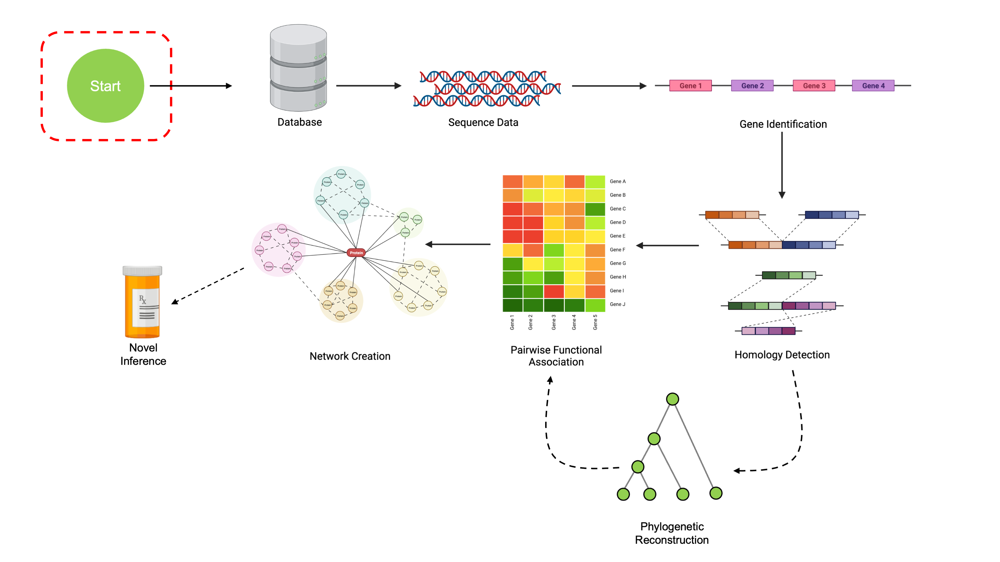
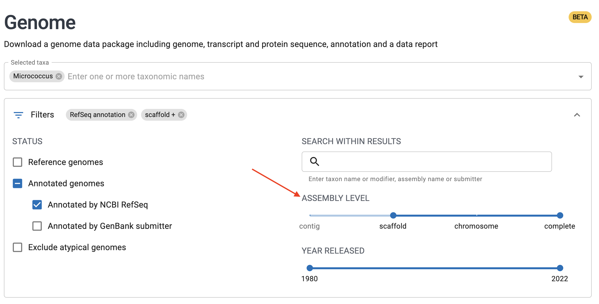
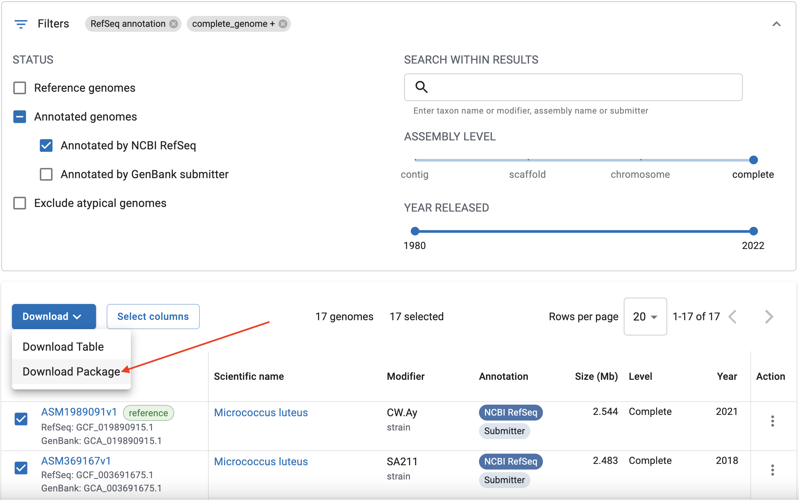
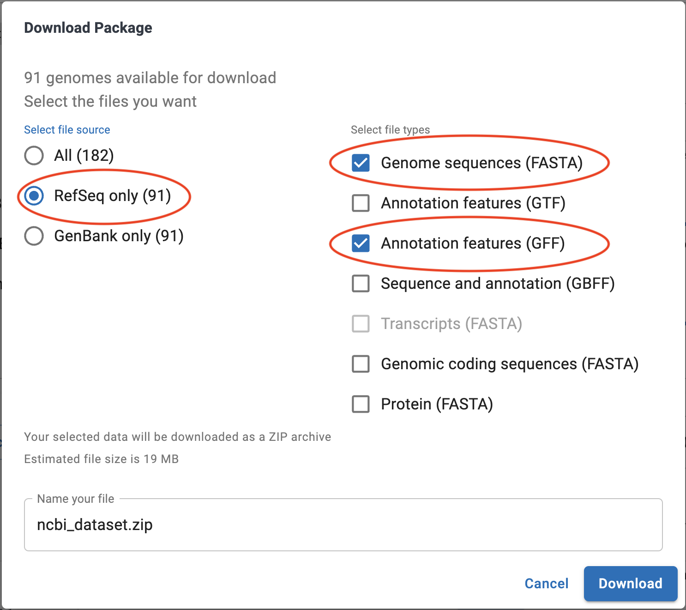

```{r setup, include=FALSE}
options(rmarkdown.html_vignette.check_title = FALSE)
knitr::opts_chunk$set(echo = TRUE)
library(downloadthis)
```

```{r echo=FALSE, out.width='100%'}

```

## Setting up your environment
This tutorial depends on a few key packages to work correctly. This page will outline
how to install all the necessary components for this workshop. If you're attending
this tutorial at Bioconductor 2022, [you can skip directly to the next page](https://www.ahl27.com/CompGenomicsBioc2022/articles/LoadingGenomeData.html).

### Docker Installation
The easiest way to run the examples in this tutorial series are via Docker.
If you have Docker installed, you can set up an environment with the following
command:

```
docker run -e PASSWORD=<password> -p 8787:8787 ghcr.io/ahl27/compgenomicsbioc2022:723220851
```

This will download the relevant Docker container and then launch an RStudio server
instance, which you can access by going to [http://localhost:8787](http://localhost:8787).
The username is by default `rstudio`, and the password is what you entered for 
`<password>`. 

Once in the Docker container, you can look at the `datafiles/` directory for 
all the files you'll need to follow along. Each folder corresponds to one 
of the tutorial pages on this site, and includes all relevant datafiles plus
an `.Rmd` file with all the code (so you don't have to copy-paste back and forth).

Note that RStudio Server running in Docker is currently incompatible with ARM Macs,
so in that case you'll have to use your own RStudio instance.

For Bioconductor workshop attendees, we'll be using the content in the `CONFERENCE_MATERIALS`
folder.

If you don't want to use Docker, see below.

### Prerequisites
All content will be shown using the [R programming language](https://www.r-project.org/). 
For existing users, note that your version of `R` must be at least version `4.2.x` 
for compatibility with the packages we'll be using and access to Bioconductor
3.16.

I also recommend using [RStudio](https://www.rstudio.com/products/rstudio/) as a 
development environment, since it's an excellent IDE with tons of features. 
This step is totally optional; feel free to use whatever development environment 
you prefer.

### Installing packages
This workshop depends on two main packages: `DECIPHER` and `SynExtend`. 
These will be installed via [Bioconductor](http://bioconductor.org/), a package 
manager for open source bioinformatics projects in R. These tutorials will use
`DECIPHER` version `2.25.0` and `SynExtend` version `1.9.6`, which are available on
the development version of Bioconductor.

```{r eval=FALSE}
if (!require("BiocManager", quietly = TRUE))
    install.packages("BiocManager")

# Set BiocManager to use development versions
BiocManager::install(version='devel')

BiocManager::install('DECIPHER')
BiocManager::install('SynExtend')
```

### Downloading Data [Optional]

If you are interested in downloading the complete dataset yourself, follow
these instructions. Note that this is not necessary; all relevant data for each
part of the workshop is provided on subsequent pages. To proceed to the next
page, use the navbar at the bottom of this page.

This workshop uses the set of all *Micrococcus* genomes with RefSeq annotations
at assembly levels of Scaffold or above. All the data are included within this 
package, so you don't have to download it yourself to be able to follow along!
Each page also contains download links for the relevant datafiles. 

If you'd like to download the data yourself, you can find the genomic data online
at [NCBI's Genomes Browser](https://www.ncbi.nlm.nih.gov/data-hub/genome/?taxon=1269&annotated_only=true&refseq_annotation=true&assembly_level=1%3A3). This link has the 
relevant query pre-filled.

You can subset this dataset to just complete genomes using the slider bar as shown:

```{r echo=FALSE, out.width='100%'}

```

Once you've selected the relevant genomes, you can download them with the
"Download Package" button.

```{r echo=FALSE, out.width='100%'}

```

In the options dialog that appears, make sure to select "RefSeq Only" on the left,
and then "Genome Sequences (FASTA)" on the right. You can optionally select
"Annotation Features (GFF)", though we'll also cover how to create our own 
annotations in this workshop.

```{r echo=FALSE, out.width='100%'}

```

Again, download links for relevant data at each section will be included,
so there is no need to do this unless you really want to.

&nbsp;

&nbsp;

&nbsp;

&nbsp;


```{css, echo=FALSE}
.pagination {
    display: flex;
    display: -webkit-flex;
    padding-left: 0;
    list-style: none;
    justify-content: center
}
```

<div class="center">
  <ul class="pagination pagination-lg">
    <li class="page-item disabled">
      <a class="page-link" href="#">&laquo;</a>
    </li>
    <li class="page-item active">
      <a class="page-link" href="https://www.ahl27.com/CompGenomicsBioc2022/articles/Setup.html">1</a>
    </li>
    <li class="page-item">
      <a class="page-link" href="https://www.ahl27.com/CompGenomicsBioc2022/articles/LoadingGenomeData.html">2</a>
    </li>
    <li class="page-item">
      <a class="page-link" href="https://www.ahl27.com/CompGenomicsBioc2022/articles/GeneCallingAnnotation.html">3</a>
    </li>
    <li class="page-item">
      <a class="page-link" href="https://www.ahl27.com/CompGenomicsBioc2022/articles/FindingCOGs.html">4</a>
    </li>
    <li class="page-item">
      <a class="page-link" href="https://www.ahl27.com/CompGenomicsBioc2022/articles/ConstructingPhylogenies.html">5</a>
    </li>
    <li class="page-item">
      <a class="page-link" href="https://www.ahl27.com/CompGenomicsBioc2022/articles/CoevolutionNetworks.html">6</a>
    </li>
    <li class="page-item">
      <a class="page-link" href="https://www.ahl27.com/CompGenomicsBioc2022/articles/Conclusion.html">7</a>
    </li>
    <li class="page-item">
      <a class="page-link" href="https://www.ahl27.com/CompGenomicsBioc2022/articles/LoadingGenomeData.html">&raquo;</a>
    </li>
  </ul>
</div>